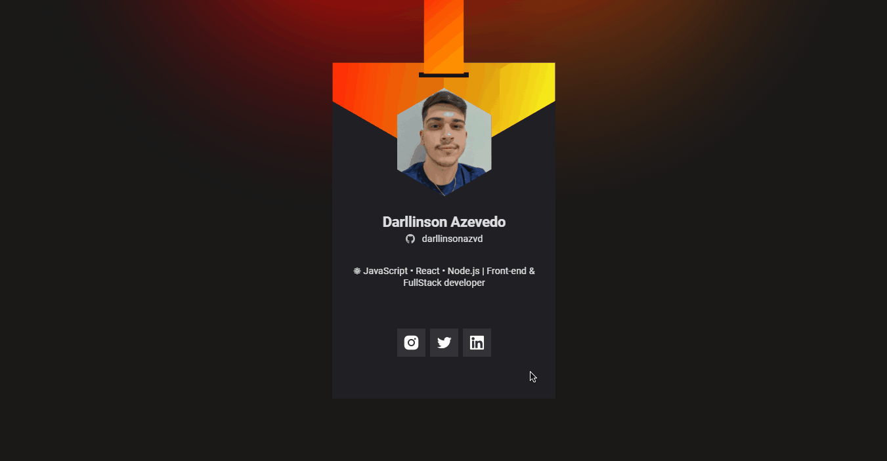

  <a href="#-tecnologias">Tecnologias</a>&nbsp;&nbsp;&nbsp;|&nbsp;&nbsp;&nbsp;
  <a href="#-projeto">Projeto</a>&nbsp;&nbsp;&nbsp;|&nbsp;&nbsp;&nbsp;
  <a href="#-layout">Layout</a>&nbsp;&nbsp;&nbsp;|&nbsp;&nbsp;&nbsp;
  <a href="#memo-licença">Licença</a>

  

  

 

  

## 🚀 Tecnologias

Esse projeto foi desenvolvido com as seguintes tecnologias:

- HTML
- CSS
- JavaScript

Bibliotecas

- [Vanilla-tilt](https://micku7zu.github.io/vanilla-tilt.js/)

## 💻 Projeto

O Developer ID Badge é um aplicativo estático com o objetivo de exibir informações do usuário trazidas da API do GitHub e inseri-las em um layout semelhante ao do evento DoWhile 2021. Se você é um dev, e quer um badge como esse, basta clonar o repositório e modificar as linhas 1 a 6 do [main.js](main.js) e todas suas redes sociais, nome, foto e bio serão atualizadas!

Conforme o cursor passa pelo badge, é reproduzida a animação feita com a biblioteca Vanilla-tilt. A mesma animação ocorre em um dispositivo móvel (smartphone ou tablet), porém, utilizando o giroscópio.

Você pode visitar o badge [clicando aqui](https://darllinsonazvd.github.io/dev-id-badge/)

## 🔖 Layout

Você pode visualizar o layout do projeto através [desse link](https://www.figma.com/file/OnMNW0cfjHJFtuP59ZSpg3/Developer-ID?node-id=0%3A1). É necessário ter conta no [Figma](https://figma.com) para acessá-lo.

## 📝 Licença

Esse projeto está sob a licença MIT. Veja o arquivo [LICENSE](.github/LICENSE.md) para mais detalhes.
